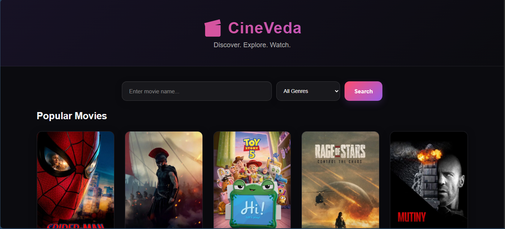
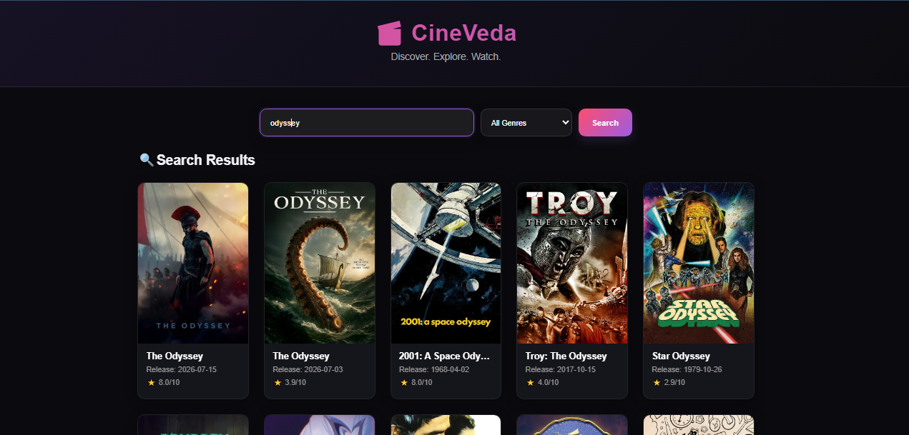
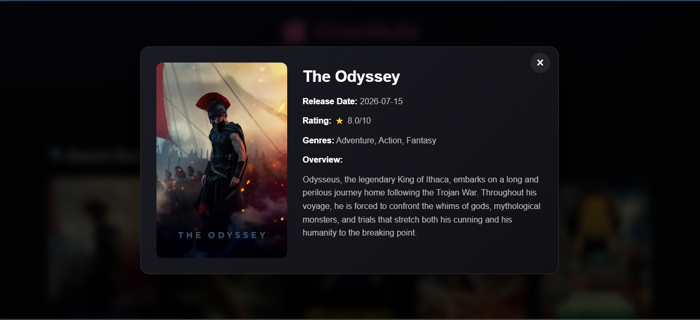

# 🎬 CineVeda

CineVeda is a movie search web application that allows users to search for movies and explore detailed information using the **TMDB API**.

## ✨ Features

* 🔍 Search movies by title
* 🎭 Filter movies by genre
* ⭐ Display movie ratings
* 📅 Display release dates
* 🖼️ Movie posters with fallback handling
* 📖 Detailed movie information
* 🎬 Interactive movie details modal
* ⌨️ Search using the Enter key
* ⚠️ Loading and error handling
* 📱 Responsive user interface

## 🛠️ Technologies Used

* HTML5
* CSS3
* JavaScript
* TMDB API

## 📸 Screenshots

### Home / Search

### Search Results

### Movie Details

## 🚀 How to Run

1. Clone this repository.
2. Open `script.js`.
3. Add your own TMDB API key.
4. Open `index.html` in your browser.

## 👨‍💻 Author

**Arghya Pal**
